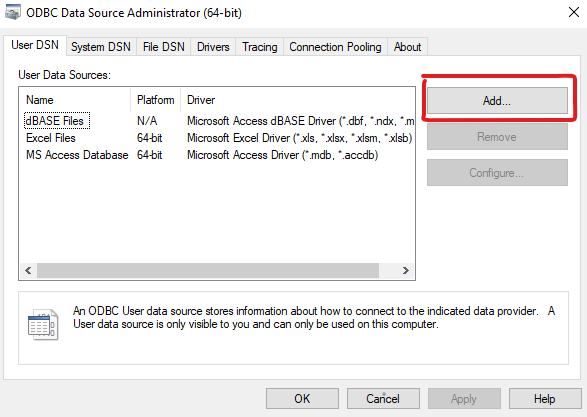
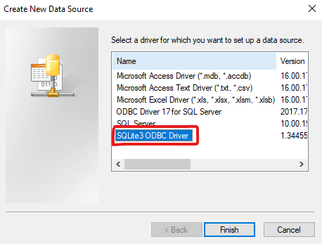
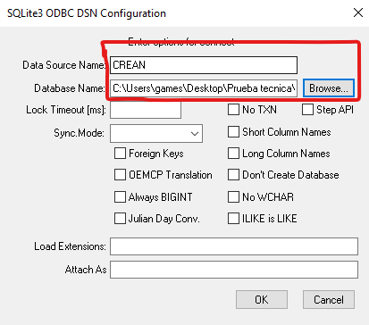
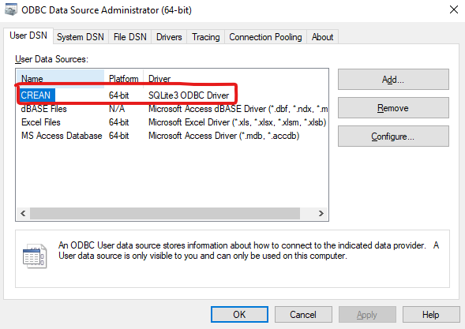

# INSTALACIÓN Y CONFIGURACIÓN DEL PROYECTO

### Clonar repositorio
```
git clone https://github.com/jDaviDEV/solucion-prueba-tecnica-CREAN.git
```
### Crear entorno virtual

Abrir el proyecto con Visual Studio Code, entrar a la terminal con CTRL + Ñ (en caso de teclado en español) o con CTRL + ` (en caso de teclado en inglés) y escribir el comando:
```
python -m venv venv
```

y activar el entorno

EN TERMINAL POWERSHELL

```powershell
.\venv\Scripts\activate
```

EN CASO DE USAR UNA TERMINAL LINUX, ENTONCES ACTIVAS EL ENTONRNO CON ESTE COMANDO:
```linux
source venv/Scripts/activate
```

### Instalar el proyecto
con el entorno virutal activo, escribir el comando
```powershell
pip install -e .
```

### Primera ejecución
EL proyecto viene con las bases de datos separadas en varios archivos .db por limitaciones de almacenamiento en github, por ello hay un script de python disponible en el poryecto dentro de la carpeta "unir_bases_de_datos", ejecuta el script con el siguiente comando:

```
pyhton .\unir_bases_de_datos\nueva_base.py
```

Esto genera una base de datos llamada "base_datos.db" donde estan todas las tablas de las bases de datos que estaban separadas. Una vez ejecutado este script no hace falta volver a ejecutarlo.

### Creacion de un DSN para la base de datos
El proyecto requiere disponibilizar el archivo "base_datos.db" en un DSN para ODBC en Windows, es necesario que instales el driver de ODBC para sqlite3 (http://www.ch-werner.de/sqliteodbc/sqliteodbc_w64.exe).

Obre ODBC en Windows y sigue los pasos:


Si la instalación del driver para sqlite3 fue correcta debe aparecer esta opción:



Se de configurar la conexion del DSN con esta misma configuración:

Data Source Name: CREAN

Database Name: debe ser la ruta del archivo .db que creamos con la primera ejecución, es decir, la base de datos donde estan todas las tablas



Al finalizar debe aparecer el DSN llamado CREAN en la lista de DSN:



### Ejucución del proyecto
Con el DSN configurado ahora se puede ejecutar el proyecto con el comando:

```
python -m solucion.main
```

Si toda la ejecución fue correcta tendrás disponible en el archivo base_datos.db una tabla que contiene la informacion del cliente con sus respectivos clusters.

Para visualizar los datos, te puedes conectar con Power BI al mismo DSN y consultar la tabla: tabla_muestra_kmeans

# VISUALIZAR LOS DATOS
Puedes ver los datos en este link:
[REPORTE BI](https://app.powerbi.com/view?r=eyJrIjoiOTM1M2JhNWMtM2Y5Ni00ZDljLTllYjYtMGZhNGU1Mjk1NjI4IiwidCI6ImNhM2YxZDZiLWZkMWYtNDBiMS1iNDFhLTQ4OGI5ODBlOWY3ZiIsImMiOjR9&pageName=255abada158245c26a30)

En caso de que el tablero no esté disponible, escribeme al correo david0804correa@gmail.com:


# Solución a la prueba técnica Analítico I CREAN

## Crear una sola base de datos

Los datos están dispersos en distintas bases, lo cual resulta incomodo y poco práctico, ya que cada base solo tiene una tabla. Todas las bases comparten un mismo contexto, por lo que resulta apropiado unirlas.

Para facilitar el trabajo con las bases de datos se procede a consolidar toda la información en un solo archivo .db de sqlite3 que permita realizar consultar SQL
estableciendo una sola conexión de ODBC desde Python. Además también resulta útil para crear un DSN de ODBC Driver en windows para hacer Business Intelligence con Power BI al obtener datos de orígenes ODBC.

---

## Exploración de los datos

Ya que se tiene toda la información consolidada en solo archiv .db, se puede hacer una exploración de los datos utilizando la herramienta DB Browser for SQLite.

### tabla clientes
- El campo de numero_id se debe reemplazar a tipo texto ya que el valor entero es muy grande y algunas herramientas de visualización de datos llegan a su límite y reemplaza todos los id por un valor predeterminado.

- Hay clientes repetidos. Solo son 8 clientes que se repiten una vez cada uno.

- El campo desc_genero presenta valores nulos equivalentes al 0.011% de la población. Debido a su baja representatividad y con el fin de evitar imputaciones basadas en supuestos no observados, dichos registros fueron excluidos del análisis.
<br>
<br>
- El campo desc_tipo_de_vivienda presenta un 68.79% de valores nulos. Debido a que existe la categoría de negocio "NO INFORMA" y los registros nulos representan ausencia de información reportada por el cliente, los valores nulos fueron homologados a dicha categoría. No se consideró la eliminación de registros debido a la alta proporción de casos afectados ni la imputación hacia categorías como "PROPIA" o "ARRENDADA", ya que esto introduciría información no observada y potenciales sesgos en el análisis.
<br>
<br>
- Los campos ingresos_mensuales, total_egresos_mensuales, total_activos, total_pasivos y total_patrimonio presentan valores nulos, que no representan una cifra significativa en la población de los datos, por lo que se pueden eliminar esos registros sin afectar el modelo.

### cantidad de datos nulos
| total_clientes | # nulos_ingresos | # nulos_egresos | # nulos_activos | # nulos_pasivos | # nulos_patrimonio |
 :---: | :---: | :---: | :---: | :---: |:---: |
|860231| 249 | 249 |249 |249 |260 |

### porcentaje de datos nulos

| total_clientes | % nulos_ingresos | % nulos_egresos | % nulos_activos | % nulos_pasivos | % nulos_patrimonio |
| :---: | :---: | :---: | :---: | :---: |:---: |
|860231| 0.029 | 0.029 | 0.029 | 0.029 | 0.03 |

#### Query empleado para obtener estos datos:
```SQL
WITH num_clientes_nulos AS (
SELECT
  COUNT(*) total_clientes,
	CAST(SUM(CASE WHEN desc_tipo_de_vivienda IS NULL THEN 1 ELSE 0 END) AS REAL) AS "# nulos_vivienda",
	CAST(SUM(CASE WHEN desc_genero IS NULL THEN 1 ELSE 0 END) AS REAL) AS "# nulos_genero",
  CAST(SUM(CASE WHEN ingresos_mensuales IS NULL THEN 1 ELSE 0 END) AS REAL) AS "# nulos_ingresos",
	CAST(SUM(CASE WHEN total_egresos_mensuales IS NULL THEN 1 ELSE 0 END) AS REAL) AS "# nulos_egresos",
  CAST(SUM(CASE WHEN total_activos IS NULL THEN 1 ELSE 0 END) AS REAL) AS "# nulos_activos",
	CAST(SUM(CASE WHEN total_pasivos IS NULL THEN 1 ELSE 0 END) AS REAL) AS "# nulos_pasivos",
	CAST(SUM(CASE WHEN total_patrimonio IS NULL THEN 1 ELSE 0 END) AS REAL) AS "# nulos_patrimonio"
FROM clientes )
SELECT
	total_clientes,
	"# nulos_vivienda",
	CAST(("# nulos_vivienda" / "total_clientes") * 100.0 AS REAL) AS "% nulos_vivienda",
	"# nulos_genero",
	CAST(("# nulos_genero" / "total_clientes") * 100.0 AS REAL) AS "% nulos_genero",
	"# nulos_ingresos",
	CAST(("# nulos_ingresos" / "total_clientes") * 100.0 AS REAL) AS "% nulos_ingresos",
	"# nulos_egresos",
	CAST(("# nulos_egresos" / "total_clientes") * 100.0 AS REAL) AS "% nulos_egresos",
	"# nulos_activos",
	CAST(("# nulos_activos" / "total_clientes") * 100.0 AS REAL) AS "% nulos_activos",
	"# nulos_pasivos",
	CAST(("# nulos_pasivos" / "total_clientes") * 100.0 AS REAL) AS "% nulos_pasivos",
	"# nulos_patrimonio",
	CAST(("# nulos_patrimonio" / "total_clientes") * 100.0 AS REAL) AS "% nulos_patrimonio"
FROM num_clientes_nulos;
```

### Otras tablas
- crean_aho_cte
- crean_bolsillos
- crean_fiducuenta
- crean_inv_virtual_cdt
- estimador_ing
- invesbot

Dentro de estas tablas también es necesario cambiar el tipo de dato del campo numero_id por tipo texto. Estas tablas no tiene valores nulos, pero se observa que las fechas no son continuas, por lo que resulta mejor hacer un modelo descriptivo que tome el ultimo registro de información conocido del cliente y analizar el estado actual del mismo.

### Feature Engineering

Debido a que el enfoque de este analsis de datos es determinar el posible nivel de adopción de la nueva app de inversiones, resulta necesario determinar que variables nos son relevantes para el análisis.

- Flujo de caja: esta variable se puede calcular restando los egresos mensuales de los ingresos mensuales del cliente, con el objetivo de concer la cantidad de dinero que le queda disponible, en este caso para posiblemente invertirlo.

- Dinero ahorrado: es la sumatoria del dinero que el cliente posee en sus cuentas de ahorro más sus bolsillos. Esto es dinero que potencialmente puede ser invertido.
  
- Dinero invertido: si el cliente ya es una persona que tiene una cultura de inversion, entonces es un potencial cliente de la nueva app.

- Edad: puede darnos una segmentación e indicadores interesantes para diseñar campañas de marketing que inciten al cliente a ivnertir.

- Segmentos del cliente: el banco ya tiene segmentando a sus clientes en distintas categorias, esta variable sirve para ver el nivel de inversión de los clientes de acuerdo a su segmentación.

- Usa el servicio de invesbot: esta variable indicará si el cliente es usuario de este servicio, que es parecido a lo que será la nueva app de inversiones, por lo tanto, si un cliente usa dicho servicio entonces es potencial cliente de usar otra servicio nuevo.

Con esta información consolidada en una tabla donde cada registro sea un cliente, y todos los campos se encuentren normalizados y en la misma escala, se puede entrenar un modelo de Clustering con Kmeans que nos ayude a identificar el comportamiento de inversion de los clientes.

---

## Creación del proyecto ETL

Con una estructura robusta y estandarizada en proyectos Python, se puede hacer una solución a este problema de modo que sea reutilizable y de fácil mantenimiento. Este proyecto se conecta con la base de datos a través de un DSN habilitando la base con un Driver de sqlite3 para OBDBC en Windows, de esta forma, la base de datos incluso podría ser consumida por otros proyectos que la requieran ya con sus datos procesados y limpios, brindando así también la oportunidad de convertir este proyecto en un proceso calendarizado que disponga la información para distintas áreas de la organización.

La estructura del proyecto está basada en la librería Orquestador2.0 para hacer proyectos de ETL.

### Flujo de ejecución
- Consolidar las bases para disponibilizar la creacion de un DSN que se conecte a la nueva base.
- Hacer limpieza de los datos disponibles en todas las tablas, con el objetivo de eliminar registros con datos nulos, registros duplicados, cambiar tipos de datos para mayor compatibilidad con distintas plataformas analíticas y de business intelligence.
- Crear una tabla maestra que contenga toda la información financiera y demográfica del cliente.
- Crear una tabla que contenga las variables de interés para el objetivb del análisis.
- Entrenar un modelo de clustering con Kmeans para segmentar a los clientes de acuerdo a sus patrones.
- Crear una nueva tabla que contenga los registros del cliente con una nueva etiqueta que indique a que cluster pertenece.

---

## Tablero Power BI

Con los clientes ya segmentados y con los datos disponibles en una tabla, se puede importar los datos dentro de Power BI para hacer un análsis de nuestros clientes.

---

# CONLUSIONES

Tras el analisis de los datos se pueden oberservar los siguientes hechos:

- la mayor cantidad de dinero invertido proviene del segmento plus, a pesar de que los clientes de este segmento tiendan a invertir, es posible que no adopten la nueva app ya que en su gran mayoria no usan el servicio de invesbot, por el contrario, los clientes del segmento preferencial usan mucho más el servicio de invesbot.
- El servicio de invesbot solo usa el 0,6% de los clientes.
- Los clientes que tienen la cultura de ahorra su dinero en cuentas de ahorro y bolsillos, son clientes que no tienden a invertir.
- Los clientes jovenes entre 18 y 25 años de edad, no tienden a invertir por que son los clientes con menor cantidad de ingresos y menor cantidad de ahorros. Los jovenes conforman un 12,87% de la muestra de los datos.
- El cluster0 es donde están el 67,74% de los clientes y que esta conformado exclusivamente por clientes del segmento personal, tienen una buena cultura de ahorro y suelen invertir en pequeñas cantidades
- El cluster1 está conformado en su gran mayoria por clientes del segmento plus conformando un 22,40% de la muestra, estos clientes tienen muy buen flujo de caja y suelen invertir cantidades moderadas de dinero.
- El cluster2 está comformado exclusivamente por clientes del segmento preferencial y son el 2,06% de la muestra, estos clientes tienen el mayor flujo de caja e invierten grandes cantidades de dinero.
- El cluster3 está conformado por clientes del segmento personal y plus, son el 7,72% de la muestra y estos son los clientes con el menor flujo de caja, la menor cantidad de ahorro y la menor cantidad de inversion
  
Para este análisis se había considerado que la variable de usa_invesbot era determinante para decir si un cliente es potencial usuario de la nueva app, pero según se ve en los datos la cantidad de clientes que usa invesbot es insignificante, esto indica que los clientes del banco prefieren hacer inversiones por medios tradicionales (cdt, inv virtual, fiducuentas...) lo que también nos da un pista de la baja adopción de nuevas tecnologías.

---

# Integración a los procesos CREAN

###  Administrar información
Esta solución consume y transforma la información financiera de los clientes, con el objetivo de hacer un análisis de segmentación del mercado para ofrecer mejores servicios a los clientes.
### Monitorear el servicio
Este proyecto permite identificar oportunidades de mejora en los futuros servicios que se le puedan ofrecer a un cliente, además también es un proyecto que puede ser calendarizado para monitorear los datos.